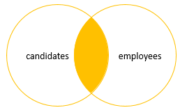
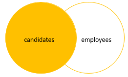
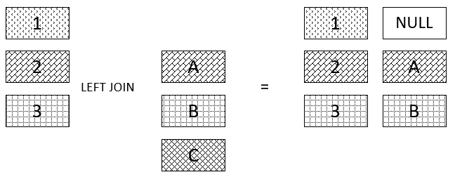
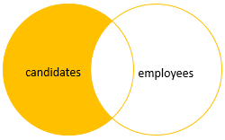
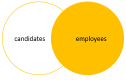
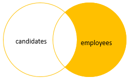
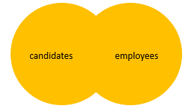
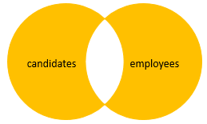
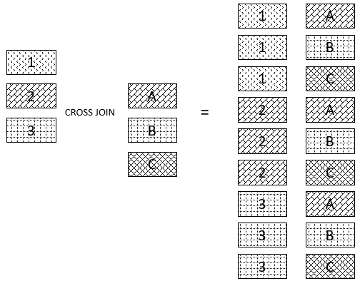

# MS SQL Server Basics

# SQL Basics in SQL Server

- Order of query: `select -> from -> where -> group by -> order by -> limit`

- Wrap with `COALESCE()` It, returns the first non-null value in a list.

  ```sql
  SELECT COALESCE(NULL, NULL, NULL, 'W3Schools.com', NULL, 'Example.com');
  ```

- Check the version of SQL Server

  ```sql
  SELECT @@VERSION
  ```

- Create a new database.

  ```sql
  CREATE DATABASE database_name
  ```

- Delete a database. note that we use `if exists` here because if we try to delete any non-existant then SQL server will give an error.

  ```sql
  DROP DATABASE IF EXISTS database_name
  ```

- A schema is a collection of database objects including tables, views, triggers, stored procedures, indexes, etc. A schema is associated with a username which is known as the schema owner, who is the owner of the logically related database objects. If we do not specify the schema then by default it will be saved in `dbo` schema

- Creating new table.

  ```sql
  CREATE TABLE schema_name.table_name (
    pk_column datatype PRIMARY KEY
    col_name1 datatype,
    col_name2 datatype,
    ...
    col_nameN datatype,
    table_constraints
  )
  ```

  We create a table in the following code.

  ```sql
  CREATE TABLE Employees (
    employee_id INT PRIMARY KEY IDENTITY(1, 1),
    first_name VARCHAR(50) NOT NULL,
    last_name VARCHAR(50) NOT NULL,
    joining_date datetime NOT NULL,
    phone VARCHAR(15) NOT NULL,
    address VARCHAR(100)
  )
  ```

- Add columns in the table

  ```sql
  ALTER TABLE schema_name.table_name
  ADD
    new_col_1 datatype constraints,
    new_col_2 datatype constraints,
    ...
    new_col_n datatype constraints;
  ```

- Delete column in the table

  ```sql
  ALTER TABLE schema_name.table_name
  DROP COLUMN col_name_1, col_name_2, col_name_3;
  ```

- Modify columns in the table. Things to remember while doing it-

  1. If data type is changed then we might encounter an error depending on the situation. E.g: the type is changed from `varchar` to `int` and there is a value `@` which sql server will not be able to convert into int, so it will give a `conversion error`.
  2. If the size of `varchar` is changed then some data might get truncated.
  3. If we want not make a column `not null` then first we have to assign values to those that are already inserted keeping that field null.
  4. Column with `check` constraint can't be modified.

  ```sql
  ALTER TABLE schema_name.table_name
  ALTER COLUMN column_name new_datatype
  ```

- We can use computed columns like the following code. SQL server will query according to the formulation and return the data. This can be stored as persistent data too. Then while a query executes, the result will be returned from the stored data. But note that we can only make persisted if the value is deterministic, we can't use it for things like `age`. **Persisted columns are calculated when the expressions they are calculated from are changed.**

  ```sql
  ALTER TABLE persons
  ADD full_name AS (first_name + " " + last_name)
  ```

- `IDENTITY(start, int)` means auto increment of the column. **SQL Server allows you to have only one identity column per table.** Usually used as a primary key. If the query rollbacks and the identity column has already incremented its value then it will not rollback. This will cause gap in the values.

- Insert data into table. If any column is missing then, identity, default value, current timestamp if the column is timesttamp datatype, null is nullable, calculated value of computed column are used.

  ```sql
  INSERT INTO schema_name.table_name (column_list)
  VALUES (value_list)
  ```

  We can explicitly assign value for `identity` column. To do this at first we need to do the following,

  ```sql
  SET IDENTITY_INSERT schema_name.table_name ON;
  ```

  By default it is turned off. To invert it, use the same command, just change the `ON` to `OFF`

  We can also insert multiple entries at a time

  ```sql
  INSERT INTO schema_name.table_name (column_list)
  VALUES (value_list), (value_list2), (value_list3)
  ```

  To get the newly inserted data we can do the following,

  ```sql
  INSERT INTO schema_name.table_name (column_list)
  OUTPUT inserted.col_name_1, inserted.col_name2, ... inserted_col_nameN
  VALUES (value_list)
  ```

- To insert data from other tables into a table, you use the following SQL Server INSERT INTO SELECT statement

  Insert all rows from another table

  ```sql
  INSERT INTO destination_schema_name.table_name (column_names)
  SELECT (column_name of src table)
  FROM src_schema_name.table_name
  ```

  Insert using conditions

  ```sql
  INSERT INTO destination_schema_name.table_name (column_names)
  SELECT (column_name of src table)
  FROM src_schema_name.table_name
  WHERE sth in (some values)
  ```

  Insert the top N of rows

  ```sql
  TRUNCATE TABLE destination_schema_name.table_name

  INSERT TOP (integer value)
  INSERT INTO destination_schema_name.table_name (column_names)
  SELECT (column_name of src table)
  FROM src_schema_name.table_name
  ORDER BY sth
  ```

  Insert the top percent of rows

  ```sql
  TRUNCATE TABLE destination_schema_name.table_name

  INSERT TOP (integer value) PERCENT
  INSERT INTO destination_schema_name.table_name (column_names)
  SELECT (column_name of src table)
  FROM src_schema_name.table_name
  ORDER BY sth
  ```

  **Note that it is a best practice to always use the TOP clause with the ORDER BY clause**

- Update the values

  ```sql
  UPDATE schema_name.table_name
  SET c1 = v1, c2 = v2, ..., cn = vn
  WHERE some_condition
  ```

  We can also update a single column of all the rows

  ```sql
  UPDATE schema_name.table_name
  SET col_name = value
  ```

- Delete from database

  Delete all

  ```sql
  DELETE FROM target_table
  ```

  Delete top rows

  ```sql
  DELETE TOP val FROM schema_name.table_name
  ```

  Delete top val% of the rows

  ```sql
  DELETE TOP val PERCENT FROM schema_name.table_name
  ```

  Delete with condition

  ```sql
  DELETE
  FROM schema_name.table_name
  WHERE some_conditions
  ```

- We can delete all the rows using `TRUNCATE`

  ```sql
  TRUNCATE TABLE schema_name.table_name
  ```

  Advantages over `delete`

  1. uses less transaction log.
  2. uses fewer locks.
  3. `identity` gets reset while using `truncate`, not `delete`

- We can use column `alias` to change column names in the result of the query. We can use this while using computed column.

  ```sql
  SELECT col_x + col_y AS some_name
  FROM schema_name.table_name
  ```

  **We can omit `AS` keyword**

  Similarly `table alias` can be used

  ```sql
  SELECT
    c.customer_id,
    first_name,
    last_name,
    order_id
  FROM
      sales.customers c
  INNER JOIN sales.orders o ON o.customer_id = c.customer_id;
  ```

- A VIEW is a virtual table, through which a selective portion of the data from one or more tables can be seen. Views do not contain data of their own. They are used to restrict access to the database or to hide data complexity

  ```sql
  CREATE VIEW view_name
  AS
  SELECT column_list
  FROM schema_name.table_name [WHERE condition];
  ```

- `BIT` datatype can hold 0, 1 or null. if we store 'True' or 'False' then SQL will convert them in to 0 and 1 respectively

- `NVARCHAR` is used to store variable length `Unicode` string data. Takes up 2 bytes per Unicode/Non-Unicode character. 2 times actual length. Used when unicode support is required.

  ```sql
  NVARCHAR(n)
  ```

- `VARCHAR` stores NOn-unicode character

  ```sql
  VARCHAR(n)
  ```

- `LEN` gives the length of the string. `DATALENGTH` gives the number of bytes of values stored in the column (both for varchar and nvarchar)

- `WHERE` is used to set conditions in query. SQL Server uses three-valued predicate logic where a logical expression can evaluate to TRUE, FALSE, or UNKNOWN. The WHERE clause will not return any row that causes the predicate evaluates to FALSE or UNKNOWN.

  Multiple conditions can be taken into consideration by using `AND`, `OR`

  We can use `>`, `<` too.

  `Between` can also be used for comparison.

  List can be used check if one of the value matches and vice-versa
  `val IN (list of values)` or `val NOT IN (list of values)`.

  `LIKE` operator can be used to match strings.

- In Matching string using `LIKE` we have some rules.

  1. `%` - This means there can be anything any number of times.
  2. `_` - This means any character but single.
  3. `[some_chars]` - Anyone of these characters.
  4. `[start-end]` - Anyone character in this range.
  5. `[^some_chars]` - Single charater, not in this list
  6. `NOT LIKE` can also be used.
  7. `ESCAPE` can be used when we need wildcards like `%`.
     for example, we strings with `30%` inside it. What we will do is,
     `val LIKE '%30!%%' ESCAPE '!'`

- `ORDER BY` sorts the result. it takes `ASC` or `DESC` as optional parameter to sort. By default SQL sorts in ascending order. **NULL is considered as the lowest val**

  ```sql
  ORDER BY
    column_name_1,
    column_name_2,
    ...
    column_name_3
  ```

  We can even use computed value or things like, `LEN`.

  First the results are sorted in the first criteria, if two row has same value in that column then 2nd criteria is considered, and so on.

- We have `Aggregate` functions that we can use

  1. `COUNT()` counts the number of rows.
  2. `DISTINCT()` returns the distinct values in that column.
  3. `MAX()` returns the max of that column.
  4. `MIN()` return the min of that column.
  5. `AVG()` returns the average value of a **numeric** column.
  6. `SUM()` return the sum of a **numeric** column.

- The GROUP BY clause allows you to arrange the rows of a query in groups. The groups are determined by the columns that you specify in the GROUP BY clause. The fields in the `select` will bbe either aggergate functions or be present in the `group by` clause

  ```sql
  SELECT
    select_list
  FROM
      schema_name.table_name
  GROUP BY
      column_name1,
      column_name2 ,...;
  ```

- Because SQL Server processes the HAVING clause after the GROUP BY clause, you cannot refer to the aggregate function specified in the select list by using the column alias

- Temporary tables are tables that exist temporarily on the SQL Server.

  The temporary tables are useful for storing the immediate result sets that are accessed multiple times.

  **The name of the temporary table starts with a hash symbol (#)**

  ```sql
  SELECT select_list
  INTO #temprary_table
  FROM src_table
  ...
  ```

  ```sql
  CREATE TABLE #schema_name.table_name (

  );
  ```

  **the temporary tables are only accessible within the session that created them**

  Sometimes, you may want to create a temporary table that is accessible across connections. In this case, you can use global temporary tables.

  Unlike a temporary table, the name of a global temporary table starts with a double hash symbol

- `Inner Join` produces a data set that includes rows from the left table which have matching rows from the right table.
  The INNER JOIN clause compares each row of the table T1 with rows of table T2 to find all pairs of rows that satisfy the join predicate. If the join predicate evaluates to TRUE, the column values of the matching rows of T1 and T2 are combined into a new row and included in the result set.

  

  ```sql
  SELECT
    select_list
  FROM
      T1
  INNER JOIN T2 ON join_predicate;
  ```

- `Left Outer Join` selects data starting from the left table and matching rows in the right table. The left join returns all rows from the left table and the matching rows from the right table. `If a row in the left table does not have a matching row in the right table, the columns of the right table will have nulls.`

  
  

  ```sql
  SELECT
    select_list
  FROM
      T1
  LEFT JOIN T2 ON
      join_predicate;
  ```

  We may want the rows that are only in the left table. We can do this by putting a `WHERE` clause where it will check one of the columns from Table-B `is null`.

  

- The `right join` or `right outer join` selects data starting from the right table. It is a reversed version of the left join.

  The right join returns a result set that contains all rows from the right table and the matching rows in the left table. If a row in the right table that does not have a matching row in the left table, all columns in the left table will contain nulls.

  

  ```sql
  SELECT
      select_list
  FROM
      T1
  RIGHT JOIN T2 ON join_predicate;
  ```

  We can keep only the rows from the right by checking if column from left is null. Just like before!

  

- The full outer join or full join returns a result set that contains all rows from both left and right tables, with the matching rows from both sides where available. In case there is no match, the missing side will have NULL values.

  

  ```sql
  SELECT
      select_list
  FROM
      T1
  FULL OUTER JOIN T2 ON join_predicate;
  ```

  If we want only those rows that are either in A or B then we use `where` and take those that has either a null coulmn from A or a null column from B.

  

- A self join allows you to join a table to itself. It is useful for querying hierarchical data or comparing rows within the same table.

  ```sql
  SELECT
      select_list
  FROM
      T t1
  [INNER | LEFT]  JOIN T t2 ON
      join_predicate;
  ```

- The `CROSS JOIN` joined every row from the first table (T1) with every row from the second table (T2). In other words, the cross join returns a Cartesian product of rows from both tables.

  

- scalar-valued functions return a single value and table-valued function return rows of data.

- Scalar-valued function

  ```sql
  CREATE FUNCTION function_name (
    @param1 datatype,
    @param2 datatype,
    ...
    @paramN datatype
  )
  RETURNS data_type AS
  BEGIN
      statements
      DECLARE @var_name vartype = value;
      DECLARE @var_name2 vartype;
      SET @var_name2 = value;
      RETURN value
  END
  ```

  **Param name should start with `@`**

  Calling the function

  ```sql
  SELECT
    schema_name.function_name(params) alias;
  ```

  **to modify just replace `CREATE` with `ALTER`**

  Remove a function

  ```sql
  DROP FUNCTION [IF EXISTS]
    function_name1,
    function_name2,
    ...;
  ```

  Remove fails when,

  1. If there are constraints like `CHECK` or `DEFAULT` and computed columns that refer to the function.
  2. If the function is referenced by views or other functions created using the `WITH SCHEMABINDING` option.

- when we use the “WITH SCHEMABINDING” clause in the definition of an object (view or function), we bind the object to the schema of all the underlying tables and views. This means that the underlying tables and views cannot be modified in a way that would affect the definition of the schema-bound object. It also means that the underlying objects cannot be dropped

- Table variables are kinds of variables that allow you to hold rows of data, which are similar to temporary tables

  ```sql
  DECLARE @table_variable_name TABLE (
    column_list
  );
  ```

  Example:

  ```sql
  DECLARE @product_table TABLE (
    product_name VARCHAR(MAX) NOT NULL,
    brand_id INT NOT NULL,
    list_price DEC(11,2) NOT NULL
  );
  ```

  **The name of the table variables must start with the @ symbol.**

  Inserting data into `Table Variable`

  ```sql
  INSERT INTO @product_table
  SELECT
      product_name,
      brand_id,
      list_price
  FROM
      production.products
  WHERE
      category_id = 1;
  ```

- Table-valued function is a user-defined function that returns data of a table type. The return type of a table-vaued function is a table, so we can use the table-values function just like we would use a table.

  ```sql
  CREATE FUNCTION udfContacts()
    RETURNS @contacts TABLE (
        first_name VARCHAR(50),
        last_name VARCHAR(50),
        email VARCHAR(255),
        phone VARCHAR(25),
        contact_type VARCHAR(20)
    )
  AS
  BEGIN
      INSERT INTO @contacts
      SELECT
          first_name,
          last_name,
          email,
          phone,
          'Staff'
      FROM
          sales.staffs;

      INSERT INTO @contacts
      SELECT
          first_name,
          last_name,
          email,
          phone,
          'Customer'
      FROM
          sales.customers;
      RETURN;
  END;
  ```

- View is the result set of a stored query on the data, which the database users can query just as they would in a persistent database

  ```sql
  CREATE VIEW [OR ALTER] schema_name.view_name [(column_list)]
  AS
      select_statement;
  ```

- Procedure

  Creation

  ```sql
  CREATE PROCEDURE proc_name(
    @param_name AS datatype,
    @aTextParamExample AS VARCHAR(max)
  )
  AS
  BEGIN
    SELECT STATEMENT
  END;
  ```

  Execution

  ```sql
  EXECUTE name @param1 = val, @param2 = val....;

  EXEC name @param1 = val, @param2 = val....;
  ```

  For modifying, we just need to chabge `CREATE` into `ALTER`

  Deleting

  ```sql
  DROP PROCEDURE proc_name

  DROP PROC proc_name
  ```

- Declare a variable

  ```sql
  DECLARE @var_name datatype;
  ```

  Set value

  ```sql
  SET @var_name = val;
  ```

  Save query result in a variable

  ```sql
  SET @var_nam = (query)
  ```

  We can even set them inside a sql query

  ```sql
  SELECT
      @VAR_NAME = COL_NAME
  FROM schema_name.table_name
  WHERE CONDITION
  ```

  IF-ELSE

  ```sql
  IF CONDITION
  BEGIN
    STATEMENT
  END
  ELSE
  BEGIN
    STATEMENT
  ELSE
  ```

  while loop

  ```sql
  WHILE CONDITION
  BEGIN
    STATEMENTS
  END
  ```

- A database cursor is an object that enables traversal over the rows of a result set. It allows you to process individual row returned by a query.

- MSSQL RANK function is used to rank the repeating values in a manner such that similar values are ranked the same. In other words, rank function returns the rank of each row within the partition of a result set. The rank of a row is one plus the number of ranks that come before the row in question

  ```sql
  RANK ( ) OVER ( [ <partition_by_clause> ] <order_by_clause> )

  SELECT EmployeeID, EmployeeName, Gender, Location,
  RANK() OVER (partition by Location, order by Gender DESC)AS Rank
  FROM Employee;
  ```

- The ROW_NUMBER function returns the serial number of the concerned row in particular partition group. Each partition group first row starts with 1.

  ```sql
  ROW_NUMBER ( ) OVER ( [ < partition_by_clause > ] < order_by_clause> )
  ```

- `EXCEPT` performs the `MINUS` operaation or `A-B` which returns elements that are present in A but absent in B

```
Venn Diagrams from https://www.sqlservertutorial.net/sql-server-basics/sql-server-joins/
```
